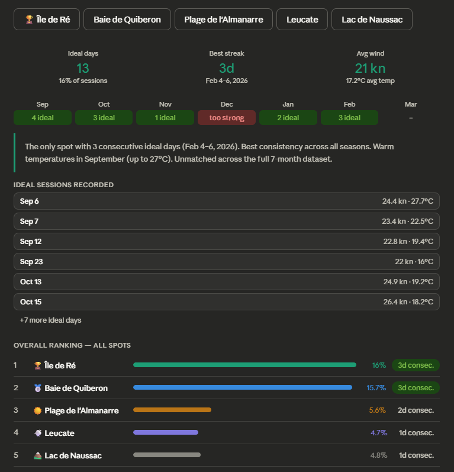
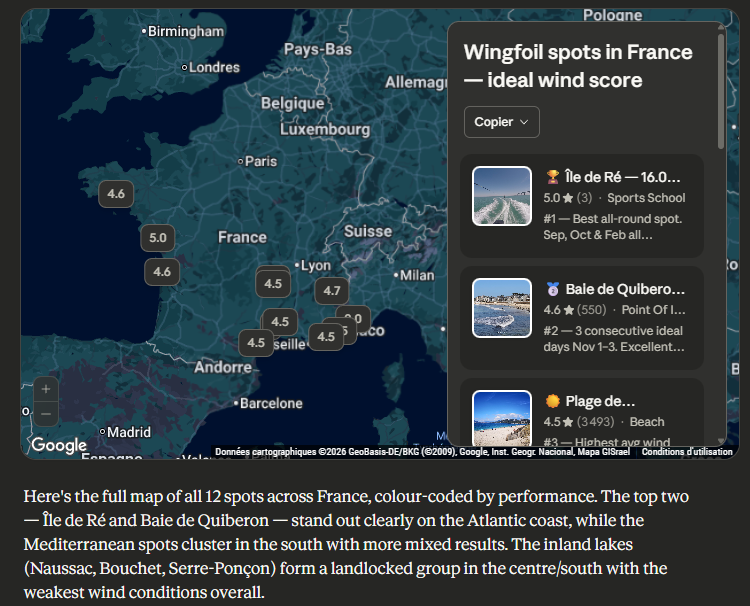

# diymcp

A lightweight MCP (Model Context Protocol) server that exposes Airtable data as tools for AI assistants.

## Motivations

Building AI-powered workflows often requires giving LLMs access to structured data stored in tools like Airtable. However, there is no standardized way for AI agents to query these sources directly.

This project bridges that gap by implementing an MCP server that wraps the Airtable API, allowing any MCP-compatible client (such as Claude Desktop or other agents) to read Airtable records as a native tool call. The goal is to provide a minimal, hackable starting point for anyone who wants to connect their own Airtable bases to an AI assistant without relying on heavy frameworks or third-party integrations.

## Airtable API

The server uses the [Airtable REST API](https://airtable.com/developers/web/api/introduction) to fetch records from a specific base and table. Authentication is done via a Personal Access Token.

Three environment variables are required:

| Variable             | Description                                                                 |
|----------------------|-----------------------------------------------------------------------------|
| `AIRTABLE_BASE_ID`  | The ID of your Airtable base (starts with `app`)                           |
| `AIRTABLE_TABLE_ID` | The ID of the table to read from (starts with `tbl`)                       |
| `AIRTABLE_TOKEN`    | A Personal Access Token with read access (starts with `pat`)               |

You can generate a token from [https://airtable.com/create/tokens](https://airtable.com/create/tokens). The token needs at least the `data.records:read` scope on the target base.

The client supports pagination and will fetch up to 1000 records by default.

## Installation

**Prerequisites:** Python 3.13+ and [uv](https://docs.astral.sh/uv/).

1. Clone the repository:

```bash
git clone <repo-url>
cd diymcp
```

2. Install dependencies with uv:

```bash
uv sync
```

3. Set up your environment variables by creating an `env.sh` file:

```bash
AIRTABLE_BASE_ID="appXXXXXXXXXXXXXX"
AIRTABLE_TABLE_ID="tblXXXXXXXXXXXXXX"
AIRTABLE_TOKEN="patXXXXXXXXXXXXXX.XXXXXXXXXXXXXXXXXXXXXXXXXXXXXXXXXXXXXXXX"
```

4. Source the environment before running:

```bash
source env.sh
```

## Claude Desktop Server Configuration

To register this MCP server with Claude Desktop, edit the configuration file:

- **macOS:** `~/Library/Application Support/Claude/claude_desktop_config.json`
- **Windows:** `%APPDATA%\Claude\claude_desktop_config.json`
- **Linux:** `~/.config/Claude/claude_desktop_config.json`

Add the following entry under the `mcpServers` key (create the file if it does not exist):

```json
{
  "mcpServers": {
    "diymcp": {
      "command": "wsl.exe",
      "args": [
        "bash",
        "-lc",
        "cd /home/mathieu/diymcp && source .venv/bin/activate && AIRTABLE_BASE_ID=appXXXXXXXXXXXXXX" AIRTABLE_TABLE_ID=tblXXXXXXXXXXXXXX AIRTABLE_TOKEN=patXXXXXXXXXXXXXX.XXXXXXXXXXXXXXXXXXXXXXXXXXXXXXXXXXXXXXXX" python main.py"
      ]
    }
  }
}
```

Replace the placeholder values with your actual Airtable credentials and the absolute path to your cloned repository.

After saving the file, restart Claude Desktop. The `read_airtable_winds` tool will appear in the tools list (hammer icon) and Claude will be able to call it when relevant.

> **Tip:** You can add multiple MCP servers in the same config file by adding more entries under `mcpServers`.

## Examples of Usage

### Run the MCP server directly

```bash
source env.sh
uv run python main.py
```

The server starts on stdio and exposes the `read_airtable_winds` tool.

### Use with an MCP client (e.g. Claude Desktop)

Add the server to your MCP client configuration. For Claude Desktop, add to your config file:

```json
{
  "mcpServers": {
    "diymcp": {
      "command": "uv",
      "args": ["run", "python", "main.py"],
      "cwd": "/path/to/diymcp",
      "env": {
        "AIRTABLE_BASE_ID": "appXXXXXXXXXXXXXX",
        "AIRTABLE_TABLE_ID": "tblXXXXXXXXXXXXXX",
        "AIRTABLE_TOKEN": "patXXXXXXXXXXXXXX.XXXX"
      }
    }
  }
}
```

### Use with FastMCP CLI

```bash
source env.sh
uv run fastmcp run main.py
```

### Test the Airtable client standalone

```python
source env.sh
uv run python -c "from airtable_client import list_records; print(list_records())"
```

### Example Query: Best Wingfoil Hotspots

Once the MCP server is connected to Claude Desktop, you can ask natural-language questions about your Airtable wind data. For example:

> **You:** Using the `read_airtable_winds` tool, find the best wingfoil hotspots from the database.
> Rank the top 5 spots and for each one tell me:
> 1. The spot name and location
> 2. The prevailing wind direction and average speed
> 3. Best season / months to go
> 4. Water conditions (flat, chop, waves)
> 5. Why it's a great wingfoil spot

Claude will call the `read_airtable_winds` tool behind the scenes, retrieve all records from your Airtable base, then analyse and rank the spots according to the criteria above.

> Which spot has the longest streak of consecutive ideal wingfoil days according the satisfaction score ?



